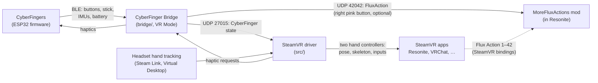
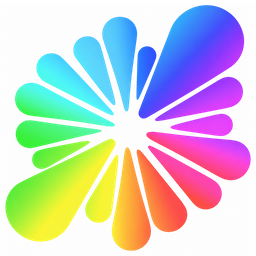

# CyberFinger documentation

CyberFinger is a VR controller for each hand, more an anti-glove than a glove. On each hand, a finger module carries
a push-stick, a trigger and a row of buttons, and a wrist module carries a screen, a black button, a pink power
button and a motion sensor (the body IMU). Some hardware revisions and models add a third button to the row (C, and D
and E beside it), a second motion sensor on the back of the hand (the joint IMU, which steadies the hand's rotation)
and a vibration motor; everything else works the same without them. Your hands stay free: the headset tracks them,
and the CyberFingers add real buttons and a stick. They charge over USB-C, and keep working while they charge (a
cable or a power bank).

This page is the map: what the pieces are, how they connect, and where each is documented.

## Where to start

| You want to… | Read |
|---|---|
| Set the CyberFingers up and use them | The **user manual**: [docs/manual](manual/). `python docs/manual/build_manual.py` builds it; `--single-file` gives one HTML file to share |
| Build, install or change the SteamVR driver and bridge | The [README](../README.md) |
| See what's planned | [STEAMVR_PLAN.md](../STEAMVR_PLAN.md) |
| Program the buttons in Resonite | [Programmable buttons in Resonite](#programmable-buttons-in-resonite) below, then the MoreFluxActions docs |

## The pieces

| Piece | Where | What it does |
|---|---|---|
| **CyberFinger firmware** | [CyberFingerFW_ESP32](https://github.com/DrSciCortex/CyberFingerFW_ESP32) | Reads the buttons, stick and motion sensors, drives the screen and the vibration motor, talks Bluetooth LE |
| **CyberFinger Bridge** | [`bridge/`](../bridge/) (`cyberfinger_gui.py`) | Connects to both CyberFingers and forwards them to the driver (VR Mode) or emulates a gamepad. Runs the vibration, mutes the microphone from the right pink button, and shows each CyberFinger's state |
| **SteamVR driver** | [`src/`](../src/) | Two hand controllers for SteamVR: CyberFinger inputs, plus hand pose and skeleton from the headset's hand tracking, with the CyberFinger's sensors bridging short gaps. Bindings for Resonite, VRChat and other apps |
| **Fusion Studio** | [`bridge/fusion_studio.py`](../bridge/fusion_studio.py) | Research tool: fuses camera, CyberFinger sensors and EMG into one tracked hand |
| **MoreFluxActions** | [MoreFluxActionsMod](https://github.com/DrSciCortex/MoreFluxActionsMod) | A Resonite mod: 42 extra bindable actions that reach ProtoFlux on your avatar |
| **SteamVRRoleFix** | [SteamVRRoleFix](https://github.com/DrSciCortex/SteamVRRoleFix) | A plugin for Resonite's renderer: hands and input follow SteamVR when you switch between CyberFinger and the Quest controllers, and hand controllers aren't drawn as trackers |
| **CyberFingerMod** | [CyberFingerMod](https://github.com/DrSciCortex/CyberFingerMod) | A Resonite mod: locomotion follows the controller in use after a switch (1.10+), hides the virtual keyboard, and keeps your laser where your avatar puts it with the dash open |
| **ProximityGrab** | [ProximityGrab](https://github.com/SciCortex/ProximityGrab) | A Resonite mod for grabbing with your hand: a fist grabs what's near it (the grab sphere, not the laser), and an index-thumb pinch is a precision grab at the pinch point |

## Programmable buttons in Resonite

Resonite only knows a fixed set of controller actions. The **MoreFluxActions** mod adds 42 more, *Flux Action 1*
to *42*, which you can bind to any button in SteamVR. Each press and release fires a ProtoFlux dynamic impulse on
your avatar, so a button can do whatever you build: equip a tool, fly, show a hat, play a sound, advance a slide.

The CyberFinger is set up for it out of the box:

- **Black wrist button, held (about a second):** Flux Action 1 on the left CyberFinger, Flux Action 2 on the right. A
  short press still opens Resonite's dash. The driver reports the hold as a separate input, **A held**, which
  the default Resonite binding maps to Flux Action 1/2. You can rebind it like any other input. The hold time is
  the driver's `black_hold_ms` setting (800 ms).
- **Right pink button:** by default (the bridge's *Right pink button* on **SteamVR**) it reaches Resonite as
  FluxAction42, which the mod makes Resonite's own mute (its `MuteToggleAction`, 42 by default) (in VRChat it is VRChat's
  mute). Set it to **FluxAction** and pick a number (42 unless you change it) to send it straight to the mod
  instead, for your own flux, or to **mic mute** to mute Windows' microphone for every app.
- **C, D and E** (on CyberFingers that have them): Flux Actions 3 and 4 (C, left and right), 5 and 6 (D), 7 and 8 (E).
- **Hand gestures:** the two-finger point (index and middle out, the thumb over the other two) is Flux Action 36
  (left) and 37 (right), the thumb-pinky pinch 38 and 39, pointing with the index finger 40 and 41. They only do
  something once you build flux for them. Pointing happens a lot, so pick what you put there with care.
- **Anything else:** in SteamVR's controller bindings for Resonite, open the **Flux Actions** tab and pick an
  action for any input.

Without the mod, the hold and the other Flux Actions do nothing: Resonite doesn't know them. To start:

1. Install [MoreFluxActions](https://github.com/DrSciCortex/MoreFluxActionsMod) with a Resonite mod manager
   (Gale, r2modman). It brings its dependencies.
2. Try the ready-made examples. Enable ResoniteLink in your session, then run `python tools/deploy.py all` from
   the mod's repository. It builds a console that logs every Flux Action, a Dev Tool on Flux Action 1, and
   fly/walk on Flux Action 2, straight onto your avatar.
3. Build your own: react to the dynamic impulse `FluxActionN.Pressed` (or `.Released`, or `FluxActionN` with a
   bool) anywhere under your avatar.

The mod's documentation explains the rest:
[architecture](https://github.com/DrSciCortex/MoreFluxActionsMod/blob/main/docs/architecture.md),
[examples](https://github.com/DrSciCortex/MoreFluxActionsMod/blob/main/docs/examples.md),
[developing your own actions](https://github.com/DrSciCortex/MoreFluxActionsMod/blob/main/docs/developing.md),
and [ideas](https://github.com/DrSciCortex/MoreFluxActionsMod/blob/main/docs/ideas.md).

The MoreFluxActions icon is adapted from the [Resonite logo](https://wiki.resonite.com/Resonite_Logo) (Resonite
Wiki; Resonite © Yellow Dog Man Studios s.r.o.) and, like it, licensed under
[CC BY-SA 4.0](https://creativecommons.org/licenses/by-sa/4.0/).
